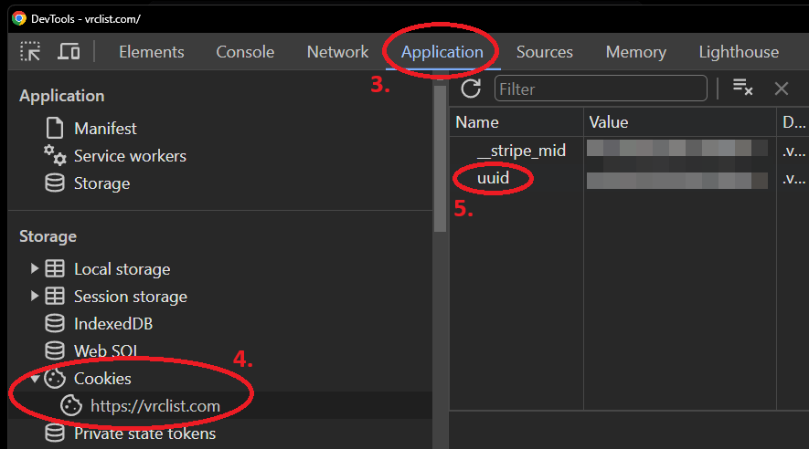

# VRCX-VRCList-Tools

A (currently small) colletion of tools for [VRCX](https://github.com/vrcx-team/VRCX) and [VRCList](https://vrclist.com).

Current features:
  - Automatically set worlds to visited on VRCList when visited


## Installation

Install python using the offical documentation https://www.python.org/downloads/

Install the requirements of this project 

```bash
pip install -r requirements.txt
```

Copy the `config.example.cfg` to `config.cfg` and replace the `uuid` value with your VRCList uuid

To get your `uuid`:
1. Go to [vrclist.com](https://vrclist.com)
2. Login and open the BrowserDevTools by pressing `F12`
3. Navigate to the `Application` tab
4. There  navigate to `Cookies` and then `https://vrclist.com`
5. Then copy the value of `uuid` and paste it into `config.cfg`



## Usage

Start the project using 

```bash
python main.py
```


## Contributing

Pull requests are welcome. For major changes, please open an issue first
to discuss what you would like to change.

Please make sure to update tests as appropriate.


## License

[MIT](https://choosealicense.com/licenses/mit/)